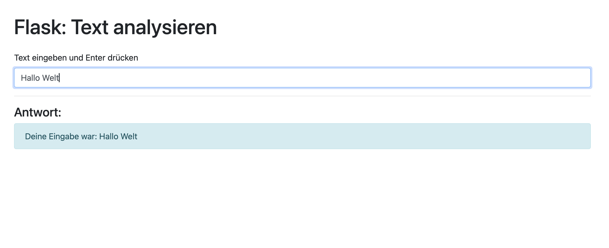

# Lernjournal 1 Python

## Repository und Library

| | Bitte ausfüllen |
| -------- | ------- |
| Repository (URL)  | https://github.com/abelasdf/mein-flask-projekt.git
| Kurze Beschreibung der App-Funktion | Dies ist eine kleine Flask-App mit HTML-Frontend und Azure-Deployment. |
| Verwendete Library aus PyPi (Name) |Flask |
| Verwendete Library aus PyPi (URL) |https://pypi.org/project/Flask/ |
| ... | |
| ... | |

## App, Funktionalität

## App, Funktionalität

Die Flask-App ist eine einfache Webanwendung, die es Nutzern ermöglicht, mit einem Eingabefeld zu interagieren. Nach dem Drücken der Enter-Taste wird die Eingabe direkt ausgewertet und eine Antwort vom Server angezeigt.

	•	Funktionalität:
	•	Eingabeformulare für den Nutzer
	•	Anzeige von dynamischen Daten
	•	Möglichkeit, API-Endpunkte zur Verarbeitung von Daten zu integrieren
	•	Einfache Fehlerbehandlung und User-Feedback

## Dependency Management

Für das Projekt wurde pip zur Verwaltung der Abhängigkeiten verwendet. Alle benötigten Bibliotheken wurden in einer virtuellen Umgebung (venv) isoliert, um sicherzustellen, dass keine Konflikte mit anderen Projekten auftreten.
	•	Virtuelle Umgebung: Eine virtuelle Umgebung wurde mit python -m venv venv erstellt und aktiviert. Alle Abhängigkeiten wurden in der requirements.txt-Datei dokumentiert und mit pip install -r requirements.txt installiert.
	•	Dies gewährleistet eine saubere Installation der Abhängigkeiten und eine reproduzierbare Entwicklungsumgebung.

 
## Deployment

Für das Deployment der Flask-Anwendung wurde Docker verwendet, um eine isolierte und reproduzierbare Umgebung zu gewährleisten. Die Anwendung wurde in einem Docker-Container verpackt und auf Heroku (oder einer anderen Plattform, falls verwendet) bereitgestellt.
	•	Docker: Ein Dockerfile wurde erstellt, um die Anwendung und ihre Abhängigkeiten zu definieren. Dies ermöglicht eine konsistente Bereitstellung auf verschiedenen Umgebungen

