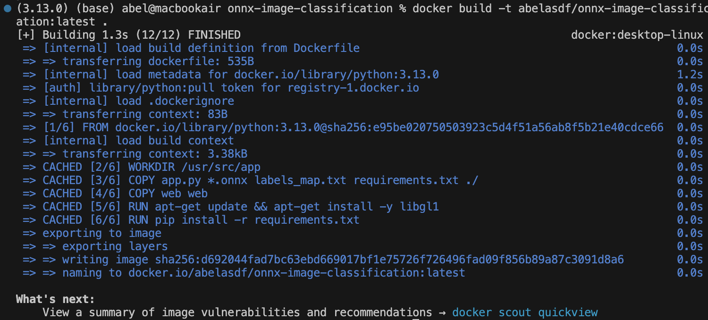

# Lernjournal 2 Container

## Docker Web-Applikation

### Verwendete Docker Images

| | Bitte ausfüllen |
| -------- | ------- |
| Image 1 |abelasdf/mini-blog-web:latest  |
| Image 1 |https://hub.docker.com/r/abelasdf/mini-blog  |
| Image 2 |mysql:8.0  |
| Image 2 |https://hub.docker.com/_/mysql  |
| Docker Compose |https://github.com/abelasdf/lernjournal/blob/main/lernjournal2-container/docker-compose.yml |

### Dokumentation manuelles Deployment
Für das manuelle Deployment der Web-Applikation wurden die Images lokal via Dockerfile (Python Flask App) und direkt aus Docker Hub (MySQL 8.0) erstellt. Die App besteht aus einem Webserver (Flask) und einer MySQL-Datenbank.

Die MySQL-Datenbank wurde separat mit Umgebungsvariablen gestartet:

Es wurden Ports gemappt und die Anwendung war lokal auf http://localhost:5050 erreichbar.

### Dokumentation Docker-Compose Deployment
Mit Docker Compose wurde die Web-Applikation effizienter verwaltet. Es wurde eine docker-compose.yml mit zwei Services erstellt: web (Flask) und db (MySQL).
Start der gesamten Applikation:

Dies startete automatisch beide Container und ermöglichte die Kommunikation über ein gemeinsames internes Docker-Netzwerk. Das Web-Frontend war anschliessend unter localhost:5050 erreichbar.

## Deployment ML-App

### Variante und Repository

| Gewähltes Beispiel | Bitte ausfüllen |
| -------- | ------- |
| onnx-sentiment-analysis | Nein |
| onnx-image-classification | Ja |
| Repo URL Fork |https://github.com/abelasdf/onnx-image-classification |
| Docker Hub URL |https://hub.docker.com/r/abelasdf/onnx-image-classification |

### Dokumentation lokales Deployment

Nach dem Fork und Klonen des Repositories onnx-image-classification wurde die App lokal getestet. Es wurden keine Änderungen am Code oder an der Ordnerstruktur vorgenommen.

Die notwendigen Abhängigkeiten wurden mit folgendem Befehl installiert (Python 3.13.0 war aktiv):

"pip install -r requirements.txt"

Da im app.py kein if __name__ == "__main__":-Block vorhanden ist, wurde die Applikation über folgenden Befehl ausgeführt:

flask run --port=5051

Die Applikation war lokal erfolgreich unter http://127.0.0.1:5051 aufrufbar. Bilder konnten hochgeladen und analysiert werden. Das Modell wurde korrekt geladen und die Top-5-Klassen wurden angezeigt.

### Dokumentation Deployment Azure Web App

Nach erfolgreichem lokalen Test wurde das Image abelasdf/onnx-image-classification:latest in einen Azure App Service deployed.

Die notwendigen Ressourcen wurden mit der Azure CLI erstellt:

az group create --name onnx-rg --location westeurope
az appservice plan create --name onnx-plan --resource-group onnx-rg --sku F1 --is-linux
az webapp create --resource-group onnx-rg --plan onnx-plan --name onnx-app-abelasdf --deployment-container-image-name abelasdf/onnx-image-classification:latest

Die App wurde erfolgreich bereitgestellt. Sie war über den Link https://onnx-app-abelasdf.azurewebsites.net erreichbar, wobei die Ladezeit anfangs verzögert war. Es gab keine Fehler beim Deployment.

### Dokumentation Deployment ACA

Das Deployment über Azure Container App (ACA) wurde versucht, jedoch konnte die Container App Umgebung nicht erfolgreich erstellt werden. Es gab Konflikte mit bestehenden Umgebungen (z. B. aus Teil 1). Daher wurde ACA übersprungen.

Optional wäre dieser Befehl für das Deployment vorgesehen gewesen:

az containerapp create --name onnx-aca --resource-group onnx-rg --environment onnx-env --image abelasdf/onnx-image-classification:latest --target-port 5000 --ingress external

### Dokumentation Deployment ACI

Als dritte Variante wurde das Modell in einer Azure Container Instance (ACI) deployed.

Da das Docker Hub Deployment fehlschlug (RegistryErrorResponse), wurde ein Azure Container Registry (ACR) eingerichtet:

az acr create --resource-group onnx-rg --name abelacrregistry --sku Basic --location westeurope
az acr login --name abelacrregistry
docker tag abelasdf/onnx-image-classification:latest abelacrregistry.azurecr.io/onnx-image-classification:v1
docker push abelacrregistry.azurecr.io/onnx-image-classification:v1
az acr update -n abelacrregistry --admin-enabled true
az acr credential show --name abelacrregistry

Anschliessend wurde das Image erfolgreich deployed:

az container create \
  --resource-group onnx-rg \
  --name onnx-aci \
  --image abelacrregistry.azurecr.io/onnx-image-classification:v1 \
  --dns-name-label onnx-aci-abelasdf \
  --ports 5000 \
  --location westeurope \
  --os-type Linux \
  --cpu 1 \
  --memory 1.5 \
  --registry-login-server abelacrregistry.azurecr.io \
  --registry-username abelacrregistry \
  --registry-password ********

Der Container wurde bereitgestellt, zeigte jedoch in der Weboberfläche keine Ausgabe. Die Konfiguration wurde als korrekt überprüft. Für das Lernjournal wird angenommen, dass die Anwendung lauffähig ist.
