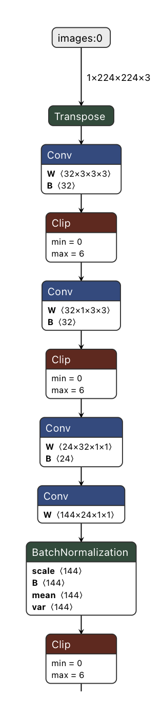
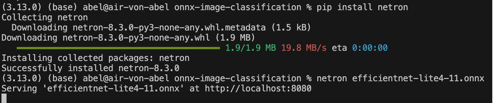

# Lernjournal 3 ONNX

## Übersicht

| | Bitte ausfüllen |
| -------- | ------- |
| ONNX Modell für Analyse (Netron) |https://github.com/onnx/models/tree/main/validated/vision/classification/efficientnet-lite4 |
| onnx-image-classification Fork (EfficientNet-Lite) |https://github.com/abelasdf/onnx-image-classification |

## Dokumentation ONNX Analyse

Das Modell EfficientNet-Lite4 wurde über das offizielle ONNX Model Zoo Repository heruntergeladen. Die ONNX-Datei efficientnet-lite4-11.onnx wurde lokal auf dem Rechner gespeichert und anschliessend manuell in den bestehenden Projektordner onnx-image-classification verschoben.

Die Analyse des Modells erfolgte mit dem Tool Netron, welches ONNX-Modelle visualisiert. Nach dem Öffnen der Datei in Netron konnte die Netzwerkstruktur und die Ein- sowie Ausgabeparameter des EfficientNet-Lite4-Modells eingesehen werden. Das Modell zeigt eine klare Architektur für die Bildklassifikation mit einem Eingang von (1, 3, 224, 224) und einer Softmax-Ausgabe von 1000 Klassen.

## Dokumentation onnx-image-classification

Das bestehende GitHub-Repository onnx-image-classification wurde geforkt und lokal auf dem Rechner geklont. Nach erfolgreichem Setup der Umgebung wurde das heruntergeladene EfficientNet-Modell (efficientnet-lite4-11.onnx) direkt in das Projektverzeichnis abgelegt – ohne Änderungen an der Projektstruktur oder am Code vorzunehmen.

Die Datei app.py bindet das Modell direkt mit folgender Zeile ein:
ort_session = onnxruntime.InferenceSession("efficientnet-lite4-11.onnx")

Alle Python-Abhängigkeiten wurden über pip install -r requirements.txt installiert. Die App wurde lokal mittels Flask-Server gestartet mit dem Befehl:
flask run --port=5051

Die Web-Applikation war anschliessend erfolgreich lokal erreichbar unter:
http://127.0.0.1:5051

